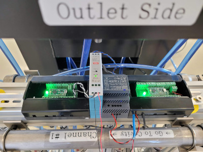
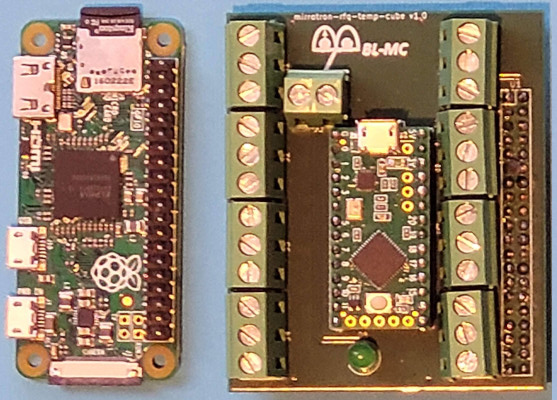
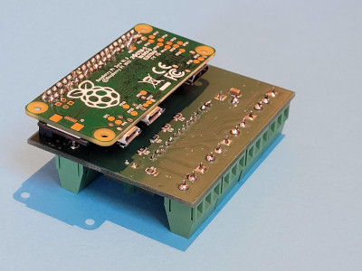
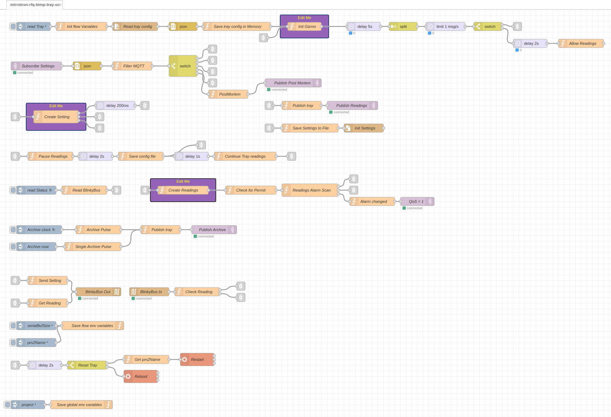

# RFQ Outlet Temperature Tray
* mirrotron-rfq-temp-tray-outlet <a href="https://github.com/bl-mirrotron/mirrotron-rfq-temp-tray-outlet" target="_blank">source code</a>
* [Cooling System Overview](https://bl-mirrotron.github.io/#cooling-system)

The function of the RFQ Outlet Temperature Tray is to receive data and check alarm status from the <a href="https://bl-mirrotron.github.io/mirrotron-rfq-temp-cube/" target="_blank">RFQ Temperature Cube</a> mounted on the outlet header as shown in Figure 1. The tray is installed on a Raspberry Pi ZeroW as shown in Figure 2. The Raspberry Pi ZeroW is actually mounted on the underside of the temperature cube as shown in Figure 3.

Because the cooling headers are located far from any Ethernet connection, the tray communicates with the <a href="https://bl-mirrotron.github.io/mirrotron-box/" target="_blank">Mirrotron-Box</a> via wireless connections. A continuously changing watchdog signal verifies that the communication link is intact. The tray code is written in the <a href="https://nodered.org/" target="_blank">Node-RED</a> programming environment. The tray code uses the standard Blinky-Lite template for serial communication using Blinky-Bus as shown in Figure 4.

Figure 1.  Outlet Cooling Header. From left to right: Temperature cube and tray, 5V power, 24V power, Flow cube and tray

 

Figure 2.  Raspberry Pi ZeroW tray along with temperature cube

 

Figure 3.  Raspberry Pi ZeroW tray mounted on temperature cube

 

Figure 4.  RFQ Outlet Temperature Tray Node-RED flow

 
